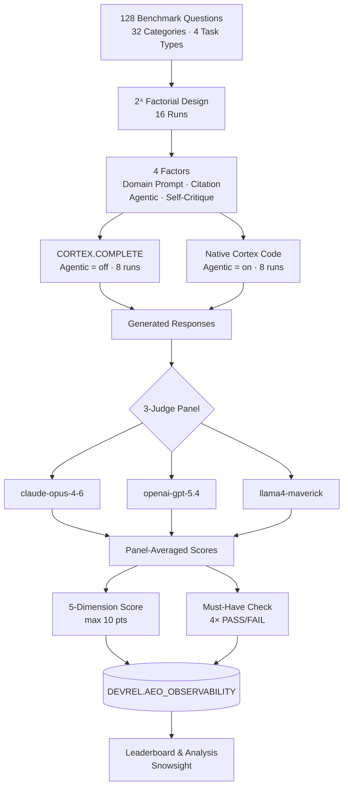

# AEO Benchmark

**AI Engine Optimization (AEO)** measures how accurately AI coding assistants answer Snowflake developer questions. Think of it as SEO, but for AI: does your assistant return the canonical, current Snowflake answer, or does it hallucinate?

## Methodology

**Question bank:** 50 questions across 13 product categories, covering four task types: Explain, Implement, Debug, and Compare.

**Conditions tested:**

| Condition | Description |
|-----------|-------------|
| Baseline | Bare LLM with no system prompt |
| Augmented | LLM with a Snowflake-focused system prompt |
| Native | Full Cortex Code harness |

**Scoring:** Each response is scored on 5 dimensions (Correctness, Completeness, Recency, Citation, Recommendation), each rated 0–2 for a maximum of 10 points. Each question also has 4 must-have elements graded PASS/FAIL.

**Judge panel:** Scores are averaged across 3 independent LLM judges (claude-opus-4-6, openai-gpt-5.4, llama4-maverick) to reduce single-model bias.

**Storage:** All runs, responses, and scores are stored in `DEVREL.AEO_OBSERVABILITY` on Snowhouse for leaderboard analysis and Snowsight visualization.

## Repository Structure

| Folder | Contents |
|--------|----------|
| [`input/`](input/) | Question bank, canonical answers, experiment prompts, and run summary |
| [`results/`](results/) | Analysis views sliced by category, question type, dimension, factor, engine, and more |
| [`scores/`](scores/) | Per-question JSON scoring files for all 16 experimental runs |
| [`slides/`](slides/) | Markdown source for methodology and results presentations |

## Presentations

- [Methodology](https://sfc-gh-cnantasenamat.github.io/aeo-methodology/) ([md](https://sfc-gh-cnantasenamat.github.io/aeo-methodology/slides.md))
- [Results](https://sfc-gh-cnantasenamat.github.io/aeo-results/) ([md](https://sfc-gh-cnantasenamat.github.io/aeo-results/slides.md))

## Pipeline

