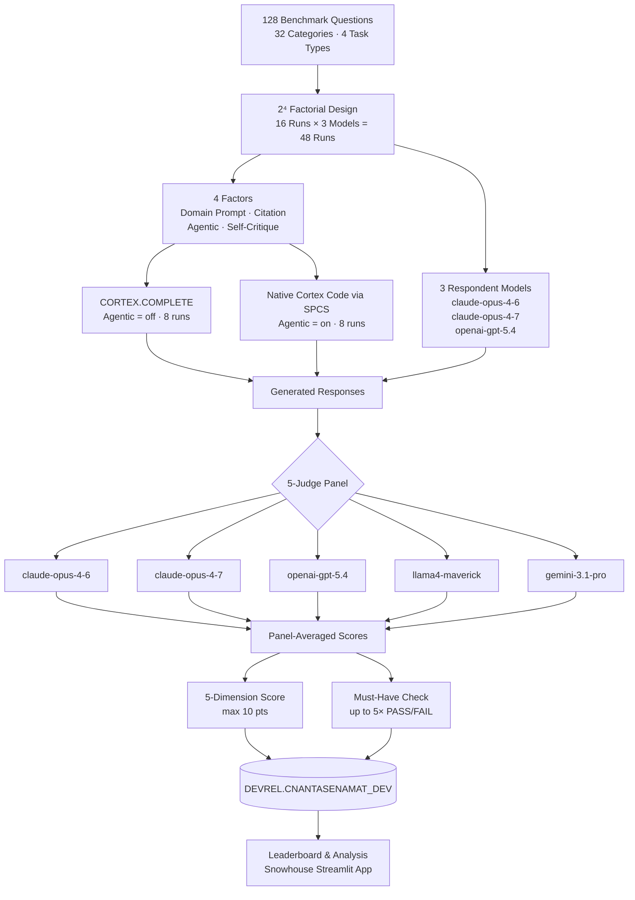

# AEO Benchmark

**AI Engine Optimization (AEO)** measures how accurately AI coding assistants answer Snowflake developer questions. Think of it as SEO, but for AI: does your assistant return the canonical, current Snowflake answer, or does it hallucinate?

## Methodology

**Question bank:** 128 questions across 32 product categories, covering four task types: Explain, Implement, Debug, and Compare.

**Experiment design:** A 2⁴ fully factorial experiment across 4 binary factors (Domain Prompt, Citation, Agentic, Self-Critique), producing 16 runs per model. v3 runs the full 16-configuration factorial across three respondent models (`claude-opus-4-6`, `claude-opus-4-7`, `openai-gpt-5.4`), for 48 total runs.

**Scoring:** Each response is scored on 5 dimensions (Correctness, Completeness, Recency, Citation, Recommendation), each rated 0–2 for a maximum of 10 points. Each question also has up to 5 must-have elements graded PASS/FAIL.

**Judge panel:** Scores are averaged across a 5-judge panel (claude-opus-4-6, claude-opus-4-7, openai-gpt-5.4, llama4-maverick, gemini-3.1-pro) to reduce single-model bias.

**Storage:** All runs, responses, and scores are stored in `DEVREL.CNANTASENAMAT_DEV` on Snowhouse for leaderboard analysis and Snowsight visualization.

## Results Summary

**Factorial runs (claude-opus-4-6, 16 runs):** Best configuration is Citation + Agentic (no domain prompt), scoring **75.9%**, a 22.7pp improvement over the bare baseline of 53.2%. Citation instruction is the dominant factor (+9.5pp average); self-critique is consistently counterproductive (−2.6pp average).

**v3 expands the full 16-run factorial to two additional models** (`claude-opus-4-7`, `openai-gpt-5.4`), enabling direct cross-model comparison of every configuration combination across all 4 factors.

## Repository Structure

| Folder | Contents |
|--------|----------|
| [`input/`](input/) | Question bank, canonical answers, experiment prompts, and run summary |
| [`results/`](results/) | Analysis views sliced by category, question type, dimension, factor, engine, and more |
| [`scores/`](scores/) | Per-question JSON scoring files for experimental runs |
| [`slides/`](slides/) | Markdown source for methodology and results presentations |
| [`scripts/`](scripts/) | Orchestrator, sweep scripts, SPCS job specs, and utilities for running and scoring benchmarks |
| [`streamlit-app-snowhouse/`](streamlit-app-snowhouse/) | Production Streamlit app deployed on Snowhouse (`DEVREL.CNANTASENAMAT_DEV`) |
| [`streamlit-app-devrel/`](streamlit-app-devrel/) | Streamlit app variant for the DevRel Snowflake account |
| [`streamlit-app-local/`](streamlit-app-local/) | Local development version of the Streamlit app |
| [`streamlit/`](streamlit/) | Legacy Streamlit app (superseded by the per-environment variants above) |
| [`paper/`](paper/) | Research paper (Markdown + LaTeX/PDF) and supporting assets |
| [`skill/`](skill/) | Cortex Code skill definition for AEO benchmark |

## Presentations

- [Methodology](https://sfc-gh-cnantasenamat.github.io/aeo-methodology/) ([md](https://sfc-gh-cnantasenamat.github.io/aeo-methodology/slides.md))
- [Results](https://sfc-gh-cnantasenamat.github.io/aeo-results/) ([md](https://sfc-gh-cnantasenamat.github.io/aeo-results/slides.md))

## Pipeline

```mermaid
flowchart TD
    A["128 Benchmark Questions
    32 Categories · 4 Task Types"] --> B["2⁴ Factorial Design
    16 Runs × 3 Models = 48 Runs"]

    B --> B1["4 Factors
    Domain Prompt · Citation
    Agentic · Self-Critique"]

    B --> M["3 Respondent Models
    claude-opus-4-6
    claude-opus-4-7
    openai-gpt-5.4"]

    B1 --> E1["CORTEX.COMPLETE
    Agentic = off · 8 runs"]
    B1 --> E2["Native Cortex Code via SPCS
    Agentic = on · 8 runs"]

    E1 --> F[Generated Responses]
    E2 --> F
    M --> F

    F --> G{5-Judge Panel}
    G --> G1[claude-opus-4-6]
    G --> G2[claude-opus-4-7]
    G --> G3[openai-gpt-5.4]
    G --> G4[llama4-maverick]
    G --> G5[gemini-3.1-pro]

    G1 --> H[Panel-Averaged Scores]
    G2 --> H
    G3 --> H
    G4 --> H
    G5 --> H

    H --> I["5-Dimension Score
    max 10 pts"]
    H --> J["Must-Have Check
    up to 5× PASS/FAIL"]

    I --> K[(DEVREL.CNANTASENAMAT_DEV)]
    J --> K
    K --> L["Leaderboard & Analysis
    Snowhouse Streamlit App"]
```
