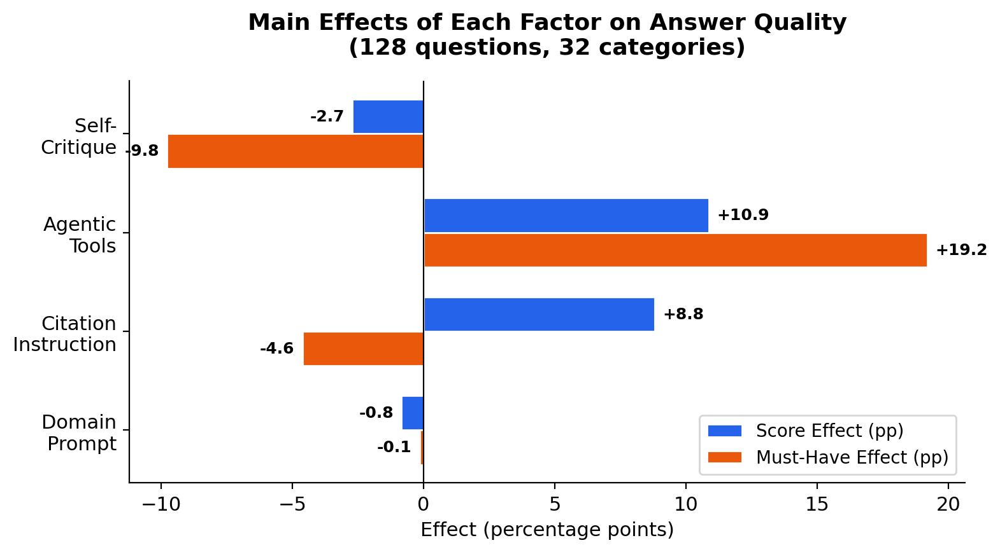
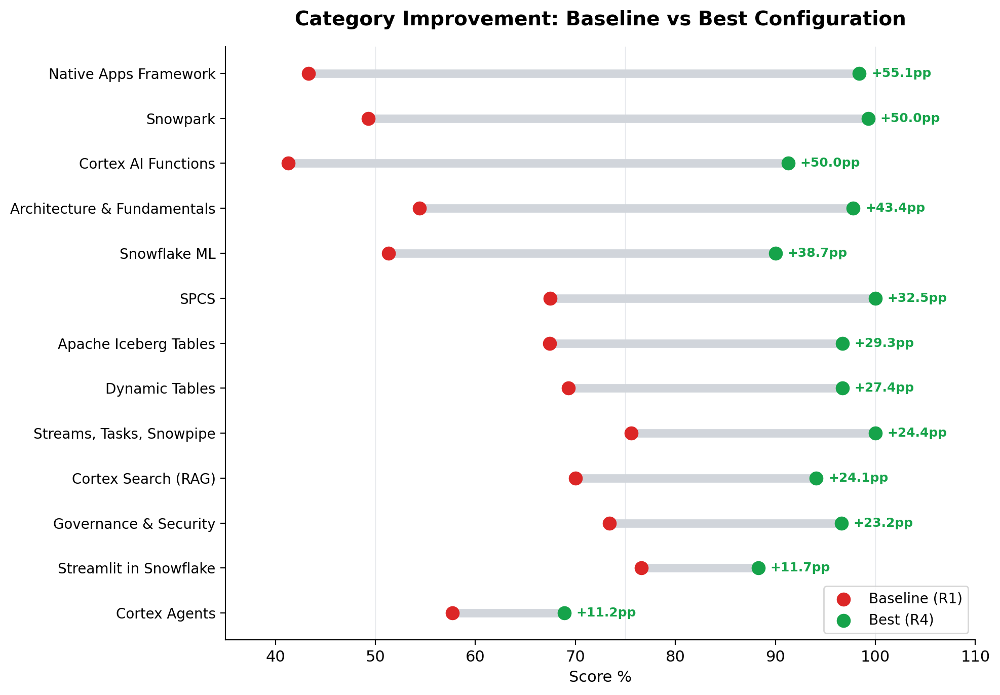
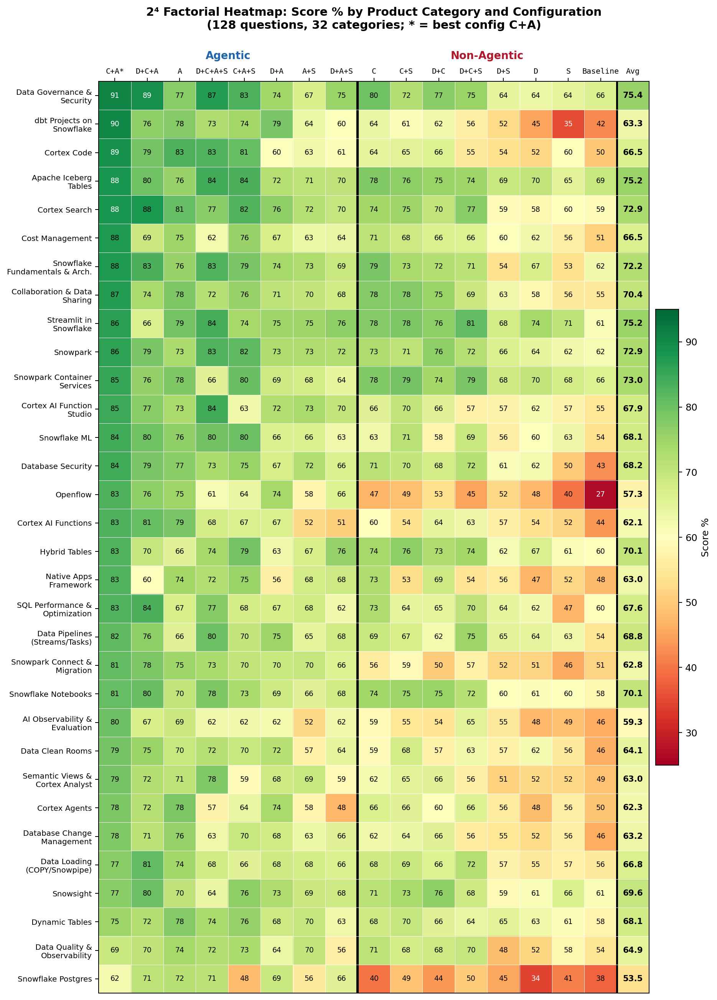

# Building an AI Engine Optimization (AEO) System for Measuring How Well LLMs Answer Snowflake Developer Questions

Chanin Nantasenamat, Daniel Myers, Umesh Unnikrishnan

*Developer Relations, Snowflake Inc.*

## Summary

AI coding assistants are now part of the Snowflake developer workflow, but there is no systematic way to measure whether those assistants give developers correct, current answers. We built an AEO benchmark that evaluates AI answer quality across 128 Snowflake developer questions spanning 32 product categories. Using a 2^4 factorial experiment design, we tested 16 combinations of four augmentation factors (domain prompt, citation instruction, agentic tools, self-critique) to isolate what actually improves answer quality. The best configuration (citation + agentic tools, no domain prompt) scored 82.3%, a 29.1 percentage-point improvement over the bare LLM baseline of 53.2%. Agentic tool access was the dominant factor (+10.9pp average), while self-critique was consistently counterproductive (-2.7pp average). These findings directly inform how Snowflake should configure its AI-powered developer tools.

## Introduction

In early 2026, Vercel built an AI Engine Optimization (AEO) system to track how AI coding agents reference and recommend their products. Their system measures brand visibility: does the agent mention Vercel products? Our system asks a different question: does the agent give the *right* answer to Snowflake developer questions?

When a developer asks an AI assistant "How do I create a Cortex Search Service?", the quality of the answer depends on more than the model's training data. What actually makes an AI assistant give better answers to developer questions?

- More instructions? Bigger system prompts?
- Access to tools and documentation?
- Self-review and revision loops?
- All of the above?

We built a controlled experiment to find out.

We designed a benchmark that goes beyond brand tracking to measure multi-dimensional answer quality (correctness, completeness, recency, citation, and recommendation) against expert-authored canonical answers. Rather than testing multiple competing agents, we tested multiple augmentation configurations on a single model (`claude-opus-4-6`) to isolate the effect of each deployment lever. The result is a data-backed framework for configuring AI developer tools on the Snowflake platform.

## Methodology

### Question Bank

We authored 128 questions across 32 Snowflake product categories, with exactly 4 questions per category. Categories span the full Snowflake developer surface including Cortex AI Functions, Cortex Search, Cortex Agents, Cortex Code, Dynamic Tables, Snowpark, Streamlit in Snowflake, Apache Iceberg Tables, Snowflake ML, Snowpark Container Services, Native Apps Framework, Data Pipelines (Streams, Tasks, Snowpipe), Data Governance & Security, Snowflake Fundamentals & Architecture, dbt Projects on Snowflake, Semantic Views & Cortex Analyst, Database Change Management, Snowflake Postgres, and others. Each question falls into one of four test types: Explain (32), Implement (32), Debug (32), or Compare (32). For every question, we wrote a canonical answer grounded in official Snowflake documentation and defined up to five must-have factual elements (up to 640 total binary pass/fail checks).

The table below shows one representative question per test type to illustrate the breadth of cognitive demands placed on respondents:

| Q# | Type | Question |
|----|------|----------|
| Q9 | Explain | What are Cortex Agents and how do they orchestrate across structured and unstructured data sources? |
| Q26 | Implement | How do I create a Snowflake-managed Iceberg table with an external volume pointing to S3? |
| Q79 | Debug | My Snowflake Postgres instance is running slowly. How do I run health checks (cache hit ratio, bloat, vacuum status, blocking queries) and interpret the results? |
| Q44 | Compare | When should I use streams/tasks vs. Dynamic Tables for data transformation pipelines? What factors should drive the decision? |

An Explain question tests conceptual understanding, an Implement question requires correct syntax and documented procedure, a Debug question requires diagnostic reasoning under a realistic failure scenario, and a Compare question demands nuanced knowledge of tradeoffs between similar options.

### Scoring Rubric

Each response was scored on five dimensions using a 0/1/2 scale (0 = miss, 1 = partial, 2 = full):

| Dimension | What It Measures |
|-----------|-----------------|
| **Correctness** | Are the facts and code accurate per current Snowflake documentation? |
| **Completeness** | Does the response cover the full answer without omitting key steps or concepts? |
| **Recency** | Does it reflect current Snowflake features and syntax rather than deprecated approaches? |
| **Citation** | Does it reference or link to official Snowflake documentation? |
| **Recommendation** | Does it suggest the Snowflake-native path when one exists? |

Maximum score per question: 10 points. Maximum per run: 1,280 points (128 questions × 10). The final score for each response is the panel average across the three judges, expressed as a percentage of the maximum. Each question also has up to five must-have binary checks, producing a separate must-have (MH) pass rate.

### Judge Panel

Every response was scored independently by three LLM judges: `openai-gpt-5.4`, `claude-opus-4-6`, and `llama4-maverick`. The final score for each response is the panel average. This design mitigates single-model scoring bias.

### Scoring Pipeline: Custom vs TruLens Native

We built a custom scoring pipeline rather than using TruLens native feedback functions. TruLens provides a standard RAG Triad: groundedness, answer relevance, and context relevance. These three metrics are well-suited for general-purpose RAG evaluation but are not sufficient for a domain-specific developer benchmark. They do not measure factual correctness against a canonical answer, they do not check for the presence of specific must-have facts, and they do not capture dimensions like Recency (is current syntax used?) or Recommendation (does the response suggest the Snowflake-native approach?).

Our custom pipeline extends the TruLens baseline in four ways:

1. **Five-dimension rubric.** We score on Correctness, Completeness, Recency, Citation, and Recommendation using a 0-10 scale per dimension, producing a richer per-question profile than the binary RAG Triad metrics.
2. **Canonical answer grounding.** Each judge scores against an expert-authored canonical answer rather than against retrieved context alone. This catches cases where the retrieval is relevant but the response is still factually wrong or incomplete relative to the documented correct answer.
3. **Must-have binary checks.** In addition to rubric scores, each question has up to five must-have factual elements that produce a separate pass/fail signal. This makes the evaluation sensitive to the presence or absence of specific facts that a practitioner would require in a production-grade answer.
4. **Three-model judge panel.** Using three heterogeneous LLM judges (`openai-gpt-5.4`, `claude-opus-4-6`, `llama4-maverick`) and averaging their scores reduces the risk of systematic bias from any single model's preferences or blind spots.

The tradeoff is that our pipeline does not produce OpenTelemetry-compatible spans or integrate natively with Snowflake AI Observability. TruLens would provide those observability capabilities out of the box. A natural next step is to migrate the scoring pipeline to TruLens so that results are visible in Snowsight under `AI & ML > Evaluations`, while retaining our custom feedback functions as TruLens `Feedback` objects backed by the same rubric prompts.

### 2^4 Factorial Experiment

We tested four binary augmentation factors in all 16 possible combinations:

| Factor | OFF | ON |
|--------|-----|-----|
| **Domain Prompt** | No system message | 1,800-token Snowflake product knowledge primer |
| **Citation** | Raw question only | "Cite official Snowflake docs" appended to question |
| **Agentic Tools** | Single `CORTEX.COMPLETE` call (parametric only) | Native Cortex Code session with web search, doc search, skills |
| **Self-Critique** | Single-turn generation | Two-turn generate-then-revise |

Non-agentic runs (8 of 16) used `SNOWFLAKE.CORTEX.COMPLETE('claude-opus-4-6', ...)` with a fixed 8,192-token output limit. Agentic runs (8 of 16) used native Cortex Code sessions with full tool access and no token output cap. All 16 runs used `claude-opus-4-6` exclusively as the respondent model to avoid cross-model contamination.

**Domain Prompt.** A 1,800-token system prompt framing the model as a Snowflake expert. The prompt is generic and contains no curated product knowledge, isolating whether role framing alone improves answers.

**Citation Instruction.** A single sentence appended directly to the user question (not a system prompt): "In your answer, reference official Snowflake documentation (docs.snowflake.com) as the authoritative source." This creates a retrieval objective with minimal intervention.

**Agentic Tools.** When ON, the model runs inside Cortex Code with access to web search, bash shell, SQL execution, and file I/O. When OFF, the model is a single-turn `CORTEX.COMPLETE` call with no tools, no memory, and an 8,192-token output cap. This is the largest architectural difference in the experiment.

**Self-Critique.** A two-turn generate-then-revise protocol. The model first answers normally, then a second turn instructs it to review and revise for factual accuracy, completeness, and correctness against current Snowflake documentation.

**Why a factorial design?** Testing factors one at a time would miss interaction effects, where two factors together behave differently than each factor alone. A full 2^4 factorial design tests every combination and makes all such interactions directly observable from the data.

Runs are numbered in Yates order: run = 1 + D + 2C + 4A + 8S, where D, C, A, S are 0 or 1. Sessions were sandboxed to prevent access to canonical answers, scoring rubrics, or benchmark files.

## Results

### Overall Rankings

The 16 configurations produced scores ranging from 53.2% to 82.3%. Config abbreviations: D = Domain Prompt, C = Citation, A = Agentic, S = Self-Critique; Baseline = all factors OFF.

| Config | Domain | Citation | Agentic | Self-Critique | Score | MH |
|--------|:------:|:--------:|:-------:|:-------------:|------:|---:|
| C+A | | ✓ | ✓ | | **82.3%** | 87.7% |
| D+C+A | ✓ | ✓ | ✓ | | 76.0% | 82.7% |
| A | | | ✓ | | 74.4% | 96.3% |
| D+C+A+S | ✓ | ✓ | ✓ | ✓ | 73.5% | 71.8% |
| C+A+S | | ✓ | ✓ | ✓ | 72.4% | 69.0% |
| D+A | ✓ | | ✓ | | 69.4% | 86.0% |
| C | | ✓ | | | 67.7% | 62.4% |
| C+S | | ✓ | | ✓ | 67.2% | 55.0% |
| D+C | ✓ | ✓ | | | 66.1% | 64.8% |
| A+S | | | ✓ | ✓ | 66.1% | 76.6% |
| D+C+S | ✓ | ✓ | | ✓ | 66.1% | 57.8% |
| D+A+S | ✓ | | ✓ | ✓ | 65.4% | 76.3% |
| D+S | ✓ | | | ✓ | 58.4% | 63.6% |
| D | ✓ | | | | 57.8% | 66.1% |
| S | | | | ✓ | 56.1% | 60.5% |
| Baseline | | | | | **53.2%** | 62.7% |

The engine split is clear: native Cortex Code sessions (with tool access) averaged 72.4% score and 80.8% MH, compared to 61.6% score and 61.6% MH for single `CORTEX.COMPLETE` calls. The top 6 configurations are all agentic, while the bottom 10 are predominantly non-agentic. The 29.1pp score range (53.2% to 82.3%) is narrower than a preliminary 50-question pilot where the range was 37pp, reflecting that a broader question bank dampens configuration-specific variance and produces more stable rank ordering.

### Main Effects

The factorial design lets us compute the average impact of turning each factor ON across all 8 paired comparisons:

| Factor | Score Effect | MH Effect |
|--------|------------:|----------:|
| Agentic Tools | **+10.9pp** | positive (dominant) |
| Citation Instruction | +8.8pp | -4.6pp |
| Domain Prompt | -0.8pp | marginal |
| Self-Critique | -2.7pp | -9.8pp |

*Figure 1. Main effects bar chart. Agentic tools are the only factor that improves both score and must-have compliance simultaneously. Self-Critique and Domain Prompt are net negative on both.*

**Agentic tools are the dominant factor.** They improve both score and must-have compliance in every single paired comparison. The ability to search current documentation and invoke specialized skills is more valuable than any prompting strategy.

**Citation instruction helps score but hurts must-have compliance.** The +8.8pp score effect comes largely from the Citation dimension itself (which rises sharply when citation instruction is active, especially when combined with agentic tools that can actually retrieve and link real documentation URLs). The -4.6pp MH effect suggests that instructing the model to cite sources sometimes causes it to pad responses with references at the expense of core factual coverage.

**Domain prompt is net negative.** Across all 8 paired comparisons the domain prompt shows a marginal -0.8pp average score effect. A 1,800-token primer cannot meaningfully cover 32 product categories; as the question bank grows, the primer's per-category coverage shrinks and its interference with retrieved information increases.

**Self-critique is counterproductive on both metrics.** It hurts score (-2.7pp) and dramatically hurts must-have pass rate (-9.8pp) across the board. The two-turn "generate then revise" pattern causes the model to second-guess correct content, introduce hedging, and sometimes remove accurate details present in the first pass.

### Category Performance

The table below compares the baseline (all factors OFF) against the best configuration (C+A: citation + agentic tools) across all 32 product categories:

| Category | Baseline | Best (C+A) | Delta |
|----------|--------:|----------:|------:|
| Openflow | 26.7% | 83.2% | +56.5pp |
| dbt Projects on Snowflake | 42.2% | 90.3% | +48.1pp |
| Database Security | 43.0% | 84.2% | +41.2pp |
| Cortex AI Functions | 43.7% | 83.0% | +39.3pp |
| Cortex Code | 49.8% | 88.8% | +39.0pp |
| Cost Management | 51.0% | 87.5% | +36.5pp |
| Native Apps Framework | 47.8% | 82.8% | +35.0pp |
| AI Observability & Evaluation | 46.3% | 80.2% | +33.9pp |
| Data Clean Rooms | 46.5% | 79.3% | +32.8pp |
| Database Change Management (DCM) | 46.2% | 78.0% | +31.8pp |
| Collaboration & Data Sharing | 55.3% | 86.8% | +31.5pp |
| Snowflake ML | 53.7% | 84.3% | +30.6pp |
| Semantic Views & Cortex Analyst | 48.8% | 79.2% | +30.4pp |
| Cortex AI Function Studio | 54.7% | 84.7% | +30.0pp |
| Snowpark Connect & Migration | 51.3% | 81.2% | +29.9pp |
| Cortex Search | 59.3% | 88.3% | +29.0pp |
| Cortex Agents | 49.5% | 78.5% | +29.0pp |
| Data Pipelines (Streams, Tasks, Snowpipe) | 54.5% | 81.5% | +27.0pp |
| Snowflake Fundamentals & Architecture | 62.2% | 87.5% | +25.3pp |
| Streamlit in Snowflake | 61.3% | 86.3% | +25.0pp |
| Snowpark | 61.5% | 86.2% | +24.7pp |
| Data Governance & Security | 66.2% | 90.8% | +24.6pp |
| Snowflake Postgres | 38.0% | 61.8% | +23.8pp |
| Hybrid Tables | 59.5% | 82.8% | +23.3pp |
| SQL Performance & Optimization | 59.5% | 82.7% | +23.2pp |
| Snowflake Notebooks (Workspaces) | 58.3% | 80.8% | +22.5pp |
| Data Loading (COPY, Snowpipe, Streaming) | 55.6% | 77.2% | +21.6pp |
| Snowpark Container Services | 66.0% | 85.3% | +19.3pp |
| Apache Iceberg Tables | 69.3% | 88.3% | +19.0pp |
| Dynamic Tables | 57.7% | 75.0% | +17.3pp |
| Snowsight | 61.2% | 76.8% | +15.6pp |
| Data Quality & Observability | 54.3% | 69.2% | +14.9pp |

Every category improved. The largest gains occurred in Openflow (+56.5pp), dbt Projects on Snowflake (+48.1pp), and Database Security (+41.2pp). Openflow also had the lowest baseline score of any category (26.7%), reflecting near-total absence of this feature in parametric model knowledge; agentic retrieval effectively filled that gap. At the other end, Snowflake Postgres remained the weakest category even under the best configuration (61.8%), driven by the operational specificity of its questions where even targeted retrieval did not reliably surface complete procedural answers. Data Quality & Observability also scored below 70% under C+A (69.2%), suggesting that newer platform capabilities with rapidly evolving documentation present a persistent challenge regardless of augmentation strategy.

*Figure 2. Dumbbell chart showing per-category improvement from baseline to best configuration (C+A) across all 32 categories. Categories are sorted by delta. Every category shows a positive gain, with Openflow benefiting the most (+56.5pp).*

### Scoring Dimension Analysis

Citation is the dimension most sensitive to configuration. Without explicit citation instruction, models score near zero on the Citation dimension (1.1/10 in the baseline). With citation instruction plus agentic tools, it reaches 7.8/10. The table below shows per-dimension scores for the baseline and best run:

| Config | Correctness | Completeness | Recency | Citation | Recommendation |
|--------|------------:|-------------:|--------:|---------:|---------------:|
| Baseline | 67.0% | 58.6% | 67.0% | 11.3% | 61.8% |
| C+A (Best) | 86.3% | 79.0% | 85.7% | 78.4% | 82.0% |
| Delta | +19.3pp | +20.4pp | +18.7pp | **+67.1pp** | +20.2pp |

The four non-Citation dimensions each improve by approximately 19 to 21pp under C+A, indicating that agentic retrieval provides broad quality gains across all dimensions rather than inflating any single metric. The Citation dimension's 67.1pp jump reflects near-total absence of citation behavior in the baseline: without explicit instruction and the ability to retrieve real documentation URLs, the model almost never cites sources.

### Full Factorial Heatmap

The heatmap below shows all 16 runs against all 32 product categories, with rows grouped by whether the agentic tools factor is ON (upper half) or OFF (lower half). The color gradient makes the agentic divide immediately visible: the upper half is predominantly green (high scores), while the lower half shifts toward yellow and red.

*Figure 3. Category-level heatmap of all 16 factorial runs across 32 product categories. Rows are grouped by Agentic factor (upper = ON, lower = OFF) and sorted by average score within each group. The rightmost column shows the run average. Factor abbreviations: D = Domain Prompt, C = Citation, A = Agentic, S = Self-Critique.*

Two structural patterns stand out. First, row color darkens sharply at the boundary between the agentic and non-agentic groups, confirming that tool access is the primary performance driver across all categories. Second, within the agentic group, configurations that include Self-Critique consistently score slightly lower than their matched counterparts without it, reinforcing the main-effects finding that the generate-then-revise step degrades rather than improves answer quality at this scale.

## Conclusion

Four actionable findings emerge from this benchmark:

1. **Deploy agentic tools, not bigger prompts.** Access to current documentation and specialized skills produces larger quality improvements than any prompting strategy. The optimal configuration uses citation instruction and agentic tools with no domain prompt, achieving 82.3% versus the 53.2% baseline (a 29.1pp improvement).

Beyond the main effects, two-way interaction effects reveal that factors do not act independently:

2. **Pair citation instruction with agentic tools.** Citation instruction is most effective when the model can actually retrieve and link real documentation. In agentic configurations, the Citation dimension jumps from 1.1/10 to 7.8/10. In non-agentic configurations, the model can only vaguely reference documentation without providing real URLs.

3. **Remove the domain prompt from agentic configurations.** A static knowledge primer shows a marginal negative main effect (-0.8pp) and actively interferes with agentic tool use in specific combinations. The best configuration (C+A) uses no domain prompt; adding the domain prompt (D+C+A) drops the score from 82.3% to 76.0%. The domain prompt is only marginally useful in non-agentic, single-call scenarios where the model has no other source of Snowflake-specific context.

4. **Do not add self-critique steps.** The generate-then-revise pattern degrades both score (-2.7pp) and must-have compliance (-9.8pp). This is the most consistent negative finding across the full 128-question dataset: self-critique hurts in every configuration where agentic tools are present.

For product teams configuring Snowflake AI developer tools, the prescription is straightforward: give the agent tool access, instruct it to cite sources, and stay out of its way.

### Limitations

This benchmark has several limitations worth noting:

- **Single respondent model.** All 16 runs use `claude-opus-4-6`; results may differ for other models.
- **Question bank coverage.** The 128-question bank spans 32 categories with 4 questions each; individual category estimates carry higher variance than aggregate scores.
- **LLM-as-judge scoring.** Even with a 3-model panel, LLM judges may differ from human expert evaluation on nuanced questions. The must-have elements are binary checks that do not capture partial credit for closely related facts.
- **No TruLens integration in production scoring.** Although we built a TruLens integration (instrumented app, custom feedback functions, Snowflake connector), the 16-run factorial experiment used our custom 3-judge pipeline rather than TruLens. This means we lack standardized OpenTelemetry tracing of retrieval and generation spans, which would provide deeper observability into why agentic runs perform better. The custom pipeline also does not produce the RAG Triad metrics (groundedness, answer relevance, context relevance) that would enable direct comparison with other TruLens-evaluated systems. Migrating the scoring pipeline to TruLens would unify evaluation with Snowflake AI Observability and make results visible in Snowsight under `AI & ML > Evaluations`.

### Next Steps

The immediate priorities are automating the pipeline for scheduled runs (to detect regressions as models and documentation change), expanding to multi-agent testing (Claude Code, Codex, Cursor) to understand competitive positioning, and building a PM-facing Streamlit interface for self-serve prompt configuration testing.

## References

- Dodds, E. and Zhou, A. (2026). "How we built AEO tracking for coding agents." *Vercel Engineering Blog*. February 9, 2026.
- Snowflake Documentation. https://docs.snowflake.com

---

*April 13, 2026*
