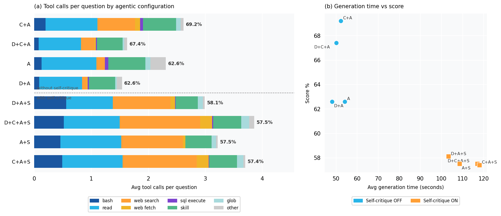
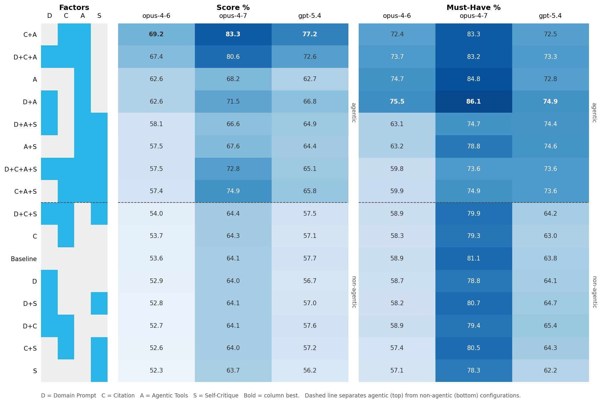

# Building an AI Engine Optimization (AEO) System for Measuring How Well LLMs Answer Snowflake Developer Questions

Chanin Nantasenamat, Daniel Myers, Umesh Unnikrishnan

*Developer Relations, Snowflake Inc.*

## Summary

AI coding assistants are now part of the Snowflake developer workflow, but there is no systematic way to measure whether those assistants give developers correct, current answers. We built an AEO benchmark that evaluates AI answer quality across 128 Snowflake developer questions spanning 32 product categories. Using a 2^4 factorial experiment design replicated across three respondent models (`claude-opus-4-6`, `claude-opus-4-7`, `openai-gpt-5.4`) with a five-model judge panel, we tested all 16 configurations of four augmentation factors (domain prompt, citation instruction, agentic tools, self-critique) for 48 total runs. For `claude-opus-4-6`, the best configuration (citation + agentic tools, no domain prompt) scored 69.2%, a 15.6 percentage-point (pp) improvement over the bare LLM baseline of 53.6%. Agentic tools is the dominant factor by both score (+8.5pp average) and must-have compliance (+9.5pp), while self-critique was consistently counterproductive (-4.1pp average). These findings directly inform how Snowflake should configure its AI-powered developer tools. For product managers, the category-level analysis surfaces three documentation gap types across the 32 product categories: Implement is the weakest question type in 50% of categories (16 of 32), reflecting incomplete how-to tutorials and code examples; Debug is weakest in 41% of categories (13 of 32), pointing to missing troubleshooting guides and runbooks; and Explain is weakest in 2 of 32 categories, indicating that conceptual documentation is thin in some high-traffic product areas. These are not AI configuration problems. They are documentation coverage problems. The [PM Action Framework](#product-category-intelligence) in the Results section maps each gap type to a concrete documentation action and identifies the specific categories with the largest gaps.

## Note on Audiences

This paper serves two distinct readers. **Engineering and platform teams** who configure AI developer tools will find the core value in the Introduction through the factorial experiment results: what levers actually improve answer quality, and by how much. **Product managers** responsible for specific Snowflake feature areas can skip directly to the [Product Category Intelligence](#product-category-intelligence) section (after the How Each Factor Affects Answer Quality subsection in Results): it contains per-category analysis of where AI currently struggles with developer questions about their product area, what that pattern reveals about documentation coverage gaps, and a concrete action framework tied to each gap type.

## Introduction

In early 2026, Vercel built an AI Engine Optimization (AEO) system to track how AI coding agents reference and recommend their products. Their system measures brand visibility: does the agent mention Vercel products? Our system asks a different question: does the agent give the *right* answer to Snowflake developer questions?

When a developer asks an AI assistant "How do I create a Cortex Search Service?", the quality of the answer depends on more than the model's training data. What actually makes an AI assistant give better answers to developer questions?

- More instructions? Bigger system prompts?
- Access to tools and documentation?
- Self-review and revision loops?
- All of the above?

We built a controlled experiment to find out.

We designed a benchmark that goes beyond brand tracking to measure multi-dimensional answer quality (correctness, completeness, recency, citation, and recommendation) against expert-authored canonical answers. Rather than testing multiple competing agents, we tested all 16 augmentation configurations across three respondent models (`claude-opus-4-6`, `claude-opus-4-7`, and `openai-gpt-5.4`) for 48 total runs, isolating the effect of each deployment lever and whether that effect holds across models. The result is a data-backed framework for configuring AI developer tools on the Snowflake platform.

## Methodology

### Question Bank

We authored 128 questions across 32 Snowflake product categories, with exactly 4 questions per category. Categories span the full Snowflake developer surface including Cortex AI Functions, Cortex Search, Cortex Agents, Cortex Code, Dynamic Tables, Snowpark, Streamlit in Snowflake, Apache Iceberg Tables, Snowflake ML, Snowpark Container Services, Native Apps Framework, Data Pipelines (Streams, Tasks, Snowpipe), Data Governance & Security, Snowflake Fundamentals & Architecture, dbt Projects on Snowflake, Semantic Views & Cortex Analyst, Database Change Management, Snowflake Postgres, and others. Each question falls into one of four test types: Explain (32), Implement (32), Debug (32), or Compare (32). For every question, we wrote a canonical answer grounded in official Snowflake documentation and defined up to five must-have factual elements (up to 640 total binary pass/fail checks).

The table below shows one representative question per test type to illustrate the breadth of cognitive demands placed on respondents:

| Q# | Type | Question |
|----|------|----------|
| Q9 | Explain | What are Cortex Agents and how do they orchestrate across structured and unstructured data sources? |
| Q26 | Implement | How do I create a Snowflake-managed Iceberg table with an external volume pointing to S3? |
| Q79 | Debug | My Snowflake Postgres instance is running slowly. How do I run health checks (cache hit ratio, bloat, vacuum status, blocking queries) and interpret the results? |
| Q44 | Compare | When should I use streams/tasks vs. Dynamic Tables for data transformation pipelines? What factors should drive the decision? |

An Explain question tests conceptual understanding, an Implement question requires correct syntax and documented procedure, a Debug question requires diagnostic reasoning under a realistic failure scenario, and a Compare question demands nuanced knowledge of tradeoffs between similar options.

### Scoring Rubric

Each response was scored on five dimensions using a 0/1/2 scale (0 = miss, 1 = partial, 2 = full):

| Dimension | What It Measures |
|-----------|-----------------|
| **Correctness** | Are the facts and code accurate per current Snowflake documentation? |
| **Completeness** | Does the response cover the full answer without omitting key steps or concepts? |
| **Recency** | Does it reflect current Snowflake features and syntax rather than deprecated approaches? |
| **Citation** | Does it reference or link to official Snowflake documentation? |
| **Recommendation** | Does it suggest the Snowflake-native path when one exists? |

Maximum score per question: 10 points. Maximum per run: 1,280 points (128 questions × 10). The final score for each response is the panel average across five judges, expressed as a percentage of the maximum. Each question also has up to five must-have binary checks, producing a separate must-have (MH) pass rate.

### Judge Panel

Every response was scored independently by five LLM judges: `claude-opus-4-6`, `claude-opus-4-7`, `openai-gpt-5.4`, `llama4-maverick`, and `gemini-3.1-pro`. The final score for each response is the panel average. This design mitigates single-model scoring bias and reduces the influence of any one model's preferences or blind spots.

### Scoring Pipeline: Custom vs TruLens Native

We built a custom scoring pipeline rather than using TruLens native feedback functions. TruLens provides a standard RAG Triad: groundedness, answer relevance, and context relevance. These three metrics are well-suited for general-purpose RAG evaluation but are not sufficient for a domain-specific developer benchmark. They do not measure factual correctness against a canonical answer, they do not check for the presence of specific must-have facts, and they do not capture dimensions like Recency (is current syntax used?) or Recommendation (does the response suggest the Snowflake-native approach?).

Our custom pipeline extends the TruLens baseline in four ways:

1. **Five-dimension rubric.** We score on Correctness, Completeness, Recency, Citation, and Recommendation using a 0-10 scale per dimension, producing a richer per-question profile than the binary RAG Triad metrics.
2. **Canonical answer grounding.** Each judge scores against an expert-authored canonical answer rather than against retrieved context alone. This catches cases where the retrieval is relevant but the response is still factually wrong or incomplete relative to the documented correct answer.
3. **Must-have binary checks.** In addition to rubric scores, each question has up to five must-have factual elements that produce a separate pass/fail signal. This makes the evaluation sensitive to the presence or absence of specific facts that a practitioner would require in a production-grade answer.
4. **Five-model judge panel.** Using five heterogeneous LLM judges (`claude-opus-4-6`, `claude-opus-4-7`, `openai-gpt-5.4`, `llama4-maverick`, `gemini-3.1-pro`) and averaging their scores reduces the risk of systematic bias from any single model's preferences or blind spots.

The tradeoff is that our pipeline does not produce OpenTelemetry-compatible spans or integrate natively with Snowflake AI Observability. TruLens would provide those observability capabilities out of the box. A natural next step is to migrate the scoring pipeline to TruLens so that results are visible in Snowsight under `AI & ML > Evaluations`, while retaining our custom feedback functions as TruLens `Feedback` objects backed by the same rubric prompts.

### Session Observability and Transcript Collection

Each run's response generation process is instrumented at the per-question level. Alongside the response text, the benchmark captures a structured observability record for every question-run pair containing:

- **Turn counts and tool usage.** The number of conversation turns, total tool invocations, and per-tool call counts across ten tracked tools: bash, file read, file write, file edit, glob, grep, SQL execution, skill invocation, web fetch, and web search. This makes the computational footprint of each answer directly measurable and comparable across configurations.
- **Token attribution.** Total input tokens, output tokens, cache read tokens, and cache write tokens per question. For agentic runs executed via the Cortex CLI, token data is attributed post-generation from `SNOWFLAKE.ACCOUNT_USAGE.CORTEX_CODE_CLI_USAGE_HISTORY` using a time-window query, since the CLI does not emit token counts inline. Prompt cache tokens are tracked separately to quantify reuse across multi-turn sessions.
- **Generation time.** Wall-clock seconds from prompt submission to response completion, enabling latency comparisons across configurations and models.
- **Request traceability.** The first and last API request identifiers for each question link observability records back to Snowflake's usage history for full auditability.
- **Full conversation transcript.** The complete multi-turn exchange is stored as newline-delimited JSON, preserving all intermediate tool calls, tool results, and model turns for post-hoc analysis.

Run-level aggregates (total turns, per-tool call distribution, cache hit rate, average generation time per question) are available through a dedicated analytics view. This observability layer enables analysis beyond scores alone: differences in tool usage patterns across configurations provide direct evidence of how each augmentation factor changes retrieval and generation behavior at the session level.

*Figure 4. Left: average tool calls per question for each of the eight agentic configurations (`claude-opus-4-6`), sorted by descending score with score annotated at the right. Colour bands show tool type; the dashed line separates configurations without self-critique (top) from those with self-critique (bottom). Right: average generation time versus score for the same eight configurations. Self-critique configurations (orange squares) cluster at 100-120 seconds with scores of 57-58%, while non-self-critique configurations (blue circles) cluster at 48-55 seconds with scores of 62-69%. The generate-then-revise step roughly doubles generation time while reducing answer quality.*

### 2^4 Factorial Experiment

We tested four binary augmentation factors in all 16 possible combinations:

| Factor | OFF | ON |
|--------|-----|-----|
| **Domain Prompt** | No system message | 1,800-token Snowflake product knowledge primer |
| **Citation** | Raw question only | "Cite official Snowflake docs" appended to question |
| **Agentic Tools** | Single `CORTEX.COMPLETE` call (parametric only) | Native Cortex Code session with web search, doc search, skills |
| **Self-Critique** | Single-turn generation | Two-turn generate-then-revise |

Non-agentic runs (8 of 16) used `SNOWFLAKE.CORTEX.COMPLETE` with a fixed 8,192-token output limit. Agentic runs (8 of 16) used native Cortex Code sessions with full tool access and no token output cap. The 16-configuration factorial is replicated across three respondent models (`claude-opus-4-6`, `claude-opus-4-7`, `openai-gpt-5.4`), producing 48 total runs. Each model runs identical sessions to enable direct cross-model comparison of configuration effects.

**Domain Prompt.** A 1,800-token system prompt framing the model as a Snowflake expert. The prompt is generic and contains no curated product knowledge, isolating whether role framing alone improves answers.

**Citation Instruction.** A single sentence appended directly to the user question (not a system prompt): "In your answer, reference official Snowflake documentation (docs.snowflake.com) as the authoritative source." This creates a retrieval objective with minimal intervention.

**Agentic Tools.** When ON, the model runs inside Cortex Code with access to web search, bash shell, SQL execution, and file I/O. When OFF, the model is a single-turn `CORTEX.COMPLETE` call with no tools, no memory, and an 8,192-token output cap. This is the largest architectural difference in the experiment.

**Self-Critique.** A two-turn generate-then-revise protocol. The model first answers normally, then a second turn instructs it to review and revise for factual accuracy, completeness, and correctness against current Snowflake documentation.

**Why a factorial design?** Testing factors one at a time would miss interaction effects, where two factors together behave differently than each factor alone. A full 2^4 factorial design tests every combination and makes all such interactions directly observable from the data.

Runs are numbered in Yates order: run = 1 + D + 2C + 4A + 8S, where D, C, A, S are 0 or 1.

**Response Generation Procedure.** Each run begins in a fresh Cortex Code session. Canonical answers, scoring rubrics, benchmark question files, and outputs from prior runs are not present in the session working directory. This isolation ensures that the respondent model cannot reference expected answers or carry over context from any previous run.

**Scoring Procedure.** Scoring is conducted in a separate session after all responses for a run are fully collected. Each of the five judges scores every response independently, with no access to the scores or assessments produced by the other judges. Panel average scores are computed post-hoc by aggregating across all five judge scores. This two-phase structure (generation then scoring) prevents response quality from being influenced by scoring feedback and prevents judges from anchoring on each other's assessments.

## Results

### Overall Rankings

The 16 configurations for `claude-opus-4-6` produced scores ranging from 52.3% to 69.2%. Config abbreviations: D = Domain Prompt, C = Citation, A = Agentic, S = Self-Critique; Baseline = all factors OFF.

**TL;DR:** The best configuration (Citation + Agentic, no domain prompt or self-critique) scored 69.2%, a 15.6pp improvement over the bare LLM baseline of 53.6%. For a breakdown of how individual Snowflake product categories performed under each configuration, see [Product Category Intelligence](#product-category-intelligence).

*Figure 5. All 16 configurations ranked by `claude-opus-4-6` score (best at top), shown for all three respondent models. Left panel shows active factors (blue = ON). Centre panel shows Score%; right panel shows Must-Have%. Bold values are column bests. The dashed line separates the eight agentic configurations (top) from the eight non-agentic configurations (bottom). The colour shift at the dashed line is visible in both Score% and Must-Have% panels, confirming that agentic tool access is the dominant driver of quality across all three models.*

The agentic divide is stark: native Cortex Code sessions (with tool access) averaged 61.5% score and 67.8% MH, compared to 53.1% score and 58.3% MH for single `CORTEX.COMPLETE` calls. All top eight positions belong to agentic configurations; non-agentic configurations first appear at rank 9. Within the non-agentic group, Citation adds virtually no benefit (53.7% for C vs. 53.6% for Baseline), a sharp reversal from earlier benchmark versions where Citation was the dominant factor. The 15.6pp score range (52.3% to 69.2%) reflects that tool access is now the only lever that meaningfully separates configurations.

### Model Baseline Comparison

The full $2^4$ factorial is replicated across three respondent models, enabling direct cross-model comparison at every configuration. The table below shows each model's score at the baseline (all factors OFF) and best-performing configuration (C+A):

| Model | Baseline Score | Baseline MH | C+A Score | C+A MH |
|-------|---------------:|------------:|----------:|-------:|
| `claude-opus-4-7` | **64.1%** | **81.1%** | **83.3%** | **83.3%** |
| `openai-gpt-5.4` | 57.7% | 63.8% | 77.2% | 72.5% |
| `claude-opus-4-6` | 53.6% | 58.9% | 69.2% | 72.4% |

`claude-opus-4-7` leads at baseline (64.1%), with a 10.5pp spread over `claude-opus-4-6` at 53.6%. `openai-gpt-5.4` sits at 57.7%. Under the best configuration (C+A), all three models improve substantially — between 15.6pp and 19.5pp lift — confirming that the C+A configuration is effective across the full model range. However, the cross-model hierarchy is preserved and the absolute spread widens: `claude-opus-4-7` reaches 83.3%, `openai-gpt-5.4` reaches 77.2%, and `claude-opus-4-6` reaches 69.2%, a 14.1pp gap between strongest and weakest in C+A mode compared to 10.5pp at baseline. Unlike earlier runs where agentic tool access compressed cross-model variance, the v3 data shows that C+A augmentation amplifies rather than equalizes model differences: stronger models leverage tool access more effectively. Model selection and agentic tool access are therefore both first-order decisions for teams configuring AI developer tools.

### How Each Factor Affects Answer Quality

The factorial design lets us compute the average impact of turning each factor ON across all 8 paired comparisons:

| Factor | Score Effect | MH Effect |
|--------|------------:|----------:|
| Agentic Tools | **+8.5pp** | **+9.5pp** |
| Citation Instruction | +1.5pp | -1.3pp |
| Self-Critique | -4.1pp | -6.7pp |
| Domain Prompt | +0.1pp | +0.6pp |

*Figure 1. How much turning each factor ON improves or hurts answer quality, in percentage points. Blue bars show score; orange bars show must-have compliance (whether answers cover the required key facts). Each bar is the average across 8 paired test runs; error bars show ±1 SE. Agentic tools is the dominant factor for both score (+8.5 pp) and must-have compliance (+9.5 pp). Citation instruction adds only +1.5 pp score and slightly reduces must-have compliance (-1.3 pp). Self-Critique hurts both (-4.1 pp score, -6.7 pp must-have). Domain Prompt has negligible effect (+0.1 pp score, +0.6 pp must-have).*

**Agentic tools is the dominant factor on both metrics.** The +8.5pp score effect and +9.5pp must-have lift are the largest of any factor. The ability to search current documentation and invoke specialized skills ensures answers both score higher and cover the required facts. This reverses the factor hierarchy from earlier benchmark versions where Citation instruction was the top score driver.

**Citation instruction has diminished effect in the agentic context.** The +1.5pp score average is modest compared to earlier runs, and Citation slightly reduces must-have compliance (-1.3pp). When agentic tools are present, the model already retrieves and cites documentation naturally — the explicit citation instruction provides little additional benefit and can divert attention from core factual coverage.

**Domain prompt has negligible effect.** Across all 8 paired comparisons the domain prompt shows a negligible +0.1pp average score effect. A 1,800-token primer cannot meaningfully cover 32 product categories; as the question bank grows, the primer's per-category coverage shrinks and its interference with retrieved information increases.

**Self-critique is counterproductive on both metrics.** It hurts score (-4.1pp) and must-have pass rate (-6.7pp) across the board. The two-turn "generate then revise" pattern causes the model to second-guess correct content, introduce hedging, and sometimes remove accurate details present in the first pass.

### Product Category Intelligence

Low AI scores on a product category are primarily a signal about documentation coverage, not a prompt configuration problem. Product managers cannot control how developers phrase questions to AI assistants, and they cannot control which retrieval configuration a tool uses. What they can control is the quality, completeness, and structure of the documentation that AI systems retrieve from. The analysis below reframes the category-level results around that lens.

The table below shows, for each of the 32 product categories, the overall score under the best configuration (C+A: citation + agentic tools) and the score broken down by question type. The weakest question type per category is highlighted, as this points most directly to a specific documentation gap.

| Category | Overall | Explain | Implement | Debug | Compare | Weakest |
|----------|--------:|--------:|---------:|------:|--------:|---------|
| AI Observability & Evaluation | 59.6% | 66.8% | 49.2% | 62.8% | 59.6% | ***Implement*** |
| Apache Iceberg Tables | 65.2% | 68.4% | 86.4% | 31.3% | 74.8% | ***Debug*** |
| Collaboration & Data Sharing | 63.4% | 63.2% | 60.4% | 45.2% | 84.8% | ***Debug*** |
| Cortex AI Function Studio | 58.4% | 36.0% | 54.4% | 67.2% | 76.0% | ***Explain*** |
| Cortex AI Functions | 65.5% | 69.2% | 60.8% | 60.0% | 72.0% | ***Debug*** |
| Cortex Agents | 55.5% | 69.6% | 30.8% | 42.3% | 79.2% | ***Implement*** |
| Cortex Code | 78.5% | 84.4% | 74.0% | 73.6% | 82.0% | ***Debug*** |
| Cortex Search | 75.2% | 72.8% | 89.6% | 57.6% | 80.8% | ***Debug*** |
| Cost Management | 68.2% | 81.2% | 61.2% | 61.2% | 69.2% | ***Impl/Debug*** |
| Data Clean Rooms | 64.0% | 77.6% | 44.8% | 61.6% | 72.0% | ***Implement*** |
| Data Governance & Security | 76.2% | 54.0% | 90.0% | 82.0% | 78.8% | ***Explain*** |
| Data Loading (COPY, Snowpipe, Streaming) | 70.8% | 85.6% | 60.0% | 67.2% | 70.4% | ***Implement*** |
| Data Pipelines (Streams, Tasks, Snowpipe) | 69.4% | 64.4% | 60.8% | 78.0% | 74.4% | ***Implement*** |
| Data Quality & Observability | 69.8% | 77.2% | 51.9% | 77.2% | 72.8% | ***Implement*** |
| Database Change Management (DCM) | 56.0% | 55.6% | 50.4% | 50.0% | 68.0% | ***Debug*** |
| Database Security | 74.7% | 84.4% | 63.6% | 66.4% | 84.4% | ***Implement*** |
| Dynamic Tables | 77.1% | 93.2% | 62.0% | 80.4% | 72.8% | ***Implement*** |
| Hybrid Tables | 73.2% | 80.8% | 64.4% | 67.6% | 80.0% | ***Implement*** |
| Native Apps Framework | 68.5% | 71.2% | 72.8% | 64.8% | 65.2% | ***Debug*** |
| Openflow | 65.2% | 73.6% | 55.2% | 47.6% | 84.4% | ***Debug*** |
| SQL Performance & Optimization | 70.8% | 74.4% | 58.4% | 70.4% | 80.0% | ***Implement*** |
| Semantic Views & Cortex Analyst | 59.3% | 76.0% | 37.6% | 66.8% | 56.8% | ***Implement*** |
| Snowflake Fundamentals & Architecture | 70.1% | 69.2% | 76.4% | 50.4% | 84.4% | ***Debug*** |
| Snowflake ML | 77.3% | 82.0% | 82.8% | 72.0% | 72.4% | ***Debug*** |
| Snowflake Notebooks (Workspaces) | 67.2% | 76.0% | 44.4% | 70.0% | 78.4% | ***Implement*** |
| Snowflake Postgres | 60.4% | 67.6% | 60.0% | 38.8% | 75.2% | ***Debug*** |
| Snowpark | 77.2% | 87.2% | 66.8% | 79.6% | 75.2% | ***Implement*** |
| Snowpark Connect & Migration | 70.5% | 70.4% | 76.0% | 59.6% | 76.0% | ***Debug*** |
| Snowpark Container Services (SPCS) | 83.9% | 94.0% | 76.8% | 78.0% | 86.8% | ***Implement*** |
| Snowsight | 79.7% | 78.0% | 76.8% | 83.2% | 80.8% | ***Implement*** |
| Streamlit in Snowflake | 72.3% | 75.6% | 68.4% | 68.8% | 76.4% | ***Implement*** |
| dbt Projects on Snowflake | 72.5% | 73.2% | 84.0% | 63.2% | 69.6% | ***Debug*** |

**Implement questions are the most common weak point across categories.** Implement is the weakest question type in 16 of 32 categories (50%). Debug is second (13/32, 41%). Only 2 categories (Cortex AI Function Studio and Data Governance & Security) are weakest on Explain questions, and 1 category (Cost Management) has a tied weakest between Implement and Debug. No category has Compare as its weakest question type. This pattern indicates that procedural documentation — working code examples, step-by-step tutorials, and correct API syntax — remains the primary coverage gap, though Debug documentation gaps have become more widespread.

The gap between the weakest question type and the category average is often severe. Cortex Agents has an Implement score of 30.8% (24.7pp below the category average of 55.5%); Apache Iceberg Tables has a Debug score of 31.3% (33.9pp below average of 65.2%, the largest single question-type gap in the benchmark); and Semantic Views & Cortex Analyst has an Implement score of 37.6% (21.7pp below average of 59.3%). These are not marginal weaknesses; they indicate that even the best-configured AI assistant fails on the majority of questions in those question types for those product areas.

#### Diagnosing and Fixing Documentation Gaps

AI systems that answer developer questions function as documentation retrieval engines at their core. Whether through real-time retrieval (agentic runs that search current documentation) or pattern recall from training data (non-agentic API calls), the ceiling on answer quality is set by what exists in the documentation. A model cannot correctly diagnose an error whose resolution is undocumented, correctly explain a feature whose conceptual overview is absent, or correctly compare two features when no comparison guide exists. Poor scores on a question type are therefore not primarily a model failure. They are a documentation coverage signal. The model is doing the best it can with what is available to retrieve.

Each question type reflects a distinct genre of documentation. When AI fails on a question type, that failure signals that the documentation covering that genre is thin or absent for the category in question.

The four question types correspond to four primary ways developers consume documentation:

1. **Debug** questions test documentation of failure states: error messages, diagnostic steps, and recovery procedures. Poor Debug scores indicate that troubleshooting guides, runbooks, and documented error patterns are missing or sparse.

2. **Compare** questions test decision guidance documentation: when to use one feature instead of another, tradeoffs, and architectural choices. Poor Compare scores indicate that decision guides and "when to use X vs. Y" pages are absent.

3. **Implement** questions test procedural documentation: working code examples, step-by-step tutorials, and correct API syntax. Poor Implement scores indicate that how-to guides are incomplete, missing working code, or reflect outdated APIs.

4. **Explain** questions test conceptual documentation: what a feature does, how it fits the platform, and why it exists. Poor Explain scores indicate that conceptual overview pages are thin or absent.

The table below provides a quick reference: find the weakest question type for a category in the per-category table above, then read across to identify the specific documentation gap and the recommended first action.

| Weakest Type | What AI struggles with | Documentation gap | Recommended action |
|---|---|---|---|
| ***Debug*** | Interpreting errors, diagnostic steps, recovery procedures | Troubleshooting guides, runbooks, common error patterns are missing or sparse | Publish how-to-debug guides per feature, document common error messages and their resolutions, add diagnostic decision trees |
| ***Compare*** | When-to-use decisions, tradeoffs between similar features | Decision guides and "when to use X vs Y" content are absent | Publish explicit comparison pages, add architectural decision guidance, document tradeoffs in context-of-use terms |
| ***Implement*** | Procedural steps, end-to-end code examples, correct syntax | How-to guides are incomplete, missing working code, or reflect outdated APIs | Audit step-by-step tutorials for completeness, add working end-to-end code examples, update deprecated syntax |
| ***Explain*** | Conceptual understanding, architecture, how components relate | Conceptual overview pages are thin or absent | Strengthen concept docs, add architecture diagrams, explain "why this feature exists" and "how it fits the platform" |

**Category-specific observations:**

- **Snowpark Container Services (SPCS)** is the highest-scoring category overall (83.9%), with Explain reaching 94.0% and all four question types above 76.8%, indicating strong documentation coverage across all developer use cases.
- **Cortex Agents** is the lowest-scoring category overall (55.5%) and has the most severe Implement gap: Implement at 30.8% versus Compare at 79.2% (a 48.4pp spread). Procedural documentation for configuring and deploying Cortex Agents is the most acute single-category gap in the benchmark.
- **Apache Iceberg Tables** has the largest single question-type gap in the benchmark: Debug at 31.3% versus Implement at 86.4% (a 55.1pp spread within one category). Troubleshooting documentation for Iceberg table errors, refresh failures, and catalog integration issues is almost entirely absent.
- **Cortex AI Function Studio** is now weakest on Explain (36.0%), not Implement. The gap between Explain and the category average (58.4%) is 22.4pp, indicating conceptual overview documentation for the Function Studio product surface is thin relative to procedural coverage.
- **Semantic Views & Cortex Analyst** shifted from Compare-weakest (v2) to Implement-weakest (37.6%, a 21.7pp gap below the 59.3% overall). End-to-end tutorials for building and querying semantic views are the primary coverage gap.
- **Snowflake Notebooks (Workspaces)** has an Implement score of 44.4% (22.8pp below the 67.2% overall). Step-by-step notebook creation and deployment documentation is sparse relative to concept coverage.
- **Snowflake Postgres** has a Debug score of 38.8% (21.6pp below the 60.4% overall). Health check, diagnostics, and troubleshooting documentation for Postgres instances is the highest-risk gap for a feature used in production.
- **Data Governance & Security** is one of two categories weakest on Explain (54.0%, a 22.2pp gap below the 76.2% overall). Conceptual overview documentation for security architecture and governance models lags behind procedural coverage.
- **Cortex AI Function Studio** and **Data Governance & Security** are the only two categories where Explain is the weakest question type, suggesting conceptual documentation is generally well-served across the platform with these two exceptions.
- **Snowsight** (79.7%), **Snowflake ML** (77.3%), **Dynamic Tables** (77.1%), and **Snowpark** (77.2%) are the next-highest overall scores after SPCS.

### Scoring Dimension Analysis

Citation is the dimension most sensitive to configuration. Without explicit citation instruction, models score near zero on the Citation dimension (1.4/10 in the baseline). With citation instruction plus agentic tools, it reaches 5.4/10. The table below shows per-dimension scores for the baseline and best run:

| Config | Correctness | Completeness | Recency | Citation | Recommendation |
|--------|------------:|-------------:|--------:|---------:|---------------:|
| Baseline | 67.9% | 54.9% | 69.4% | 13.5% | 62.0% |
| C+A (Best) | 75.2% | 66.0% | 78.8% | 54.3% | 72.0% |
| Delta | +7.3pp | +11.1pp | +9.4pp | **+40.8pp** | +10.0pp |

The four non-Citation dimensions improve by 7 to 11pp under C+A, indicating that agentic retrieval provides quality gains across all dimensions rather than inflating any single metric. The Citation dimension's 40.8pp jump reflects near-total absence of citation behavior in the baseline: without explicit instruction and the ability to retrieve real documentation URLs, the model almost never cites sources. Compared to earlier benchmark versions, the Citation jump is smaller (40.8pp vs. over 60pp), likely because the baseline now shows slightly more incidental citation behavior when using agentic tools across non-citation-instructed runs.

### Full Factorial Heatmap

The heatmap below shows all 16 runs against all 32 product categories, with columns grouped by whether the agentic tools factor is ON (left half) or OFF (right half). The color gradient makes the agentic divide immediately visible: the left half is predominantly green (high scores), while the right half shifts toward yellow and red.

*Figure 3. Category-level heatmap of all 16 factorial runs across 32 product categories. Columns are grouped by Agentic factor (left = ON, right = OFF) and sorted by average score within each group. The rightmost column shows the run average. Factor abbreviations: D = Domain Prompt, C = Citation, A = Agentic, S = Self-Critique.*

Two structural patterns stand out. First, column color darkens sharply at the boundary between the agentic and non-agentic groups, confirming that tool access is the primary performance driver across all categories. Second, within the agentic group, configurations that include Self-Critique consistently score slightly lower than their matched counterparts without it, reinforcing the main-effects finding that the generate-then-revise step degrades rather than improves answer quality at this scale.

## Conclusion

Across 16 factorial configurations and three frontier models, the benchmark evidence converges on a single prescriptive signal. For product teams configuring Snowflake AI developer tools, the prescription is straightforward: give the agent tool access, instruct it to cite sources, and stay out of its way.

Four actionable findings make this concrete:

1. **Deploy agentic tools, not bigger prompts.** Access to current documentation and specialized skills produces larger quality improvements than any prompting strategy. The optimal configuration uses citation instruction and agentic tools with no domain prompt, achieving 69.2% versus the 53.6% baseline (a 15.6pp improvement).

Beyond the main effects, two-way interaction effects reveal that factors do not act independently:

2. **Pair citation instruction with agentic tools.** Citation instruction is most effective when the model can actually retrieve and link real documentation. In agentic configurations, the Citation dimension jumps from 1.4/10 to 5.4/10. In non-agentic configurations, citation instruction adds virtually no benefit (53.7% vs. 53.6% baseline), confirming that the instruction without tool access has nothing to act on.

3. **Remove the domain prompt from agentic configurations.** A static knowledge primer shows a negligible main effect (+0.1pp) that is outweighed by interference with agentic tool use in specific combinations. The best configuration (C+A) uses no domain prompt; adding the domain prompt (D+C+A) drops the score from 69.2% to 67.4%. The domain prompt is only marginally useful in non-agentic, single-call scenarios where the model has no other source of Snowflake-specific context.

4. **Do not add self-critique steps.** The generate-then-revise pattern degrades both score (-4.1pp) and must-have compliance (-6.7pp). This is the most consistent negative finding across the full 128-question dataset: self-critique hurts in every configuration where agentic tools are present.

**For product managers**, the category-level findings point to a different kind of action. Three findings emerge from the per-category analysis:

5. **Implement documentation is the most widespread gap.** Implement is the weakest question type in 16 of 32 categories (50%), with the most severe gaps in Cortex Agents (30.8%), Semantic Views & Cortex Analyst (37.6%), and Snowflake Notebooks (44.4%). These are not AI failures; they are signals that how-to guides, end-to-end tutorials, and working code examples are missing or sparse in those product areas.

6. **Debug gaps are the second most common failure pattern.** Debug is weakest in 13 of 32 categories (41%), with gaps as large as 33.9pp (Apache Iceberg Tables), 21.6pp (Snowflake Postgres), and 17.6pp (Cortex Search and Openflow). See the [PM Action Framework](#product-category-intelligence) in the Results section for the documentation action that maps to each gap type.

7. **Model choice matters independently of configuration, and the gap widens at higher quality.** The three-model baseline comparison shows a 10.5pp spread between the strongest respondent (`claude-opus-4-7` at 64.1%) and the weakest (`claude-opus-4-6` at 53.6%). Under the best configuration (C+A), all three models improve substantially but the spread widens to 14.1pp (`claude-opus-4-7` at 83.3% vs. `claude-opus-4-6` at 69.2%). Model selection and agentic tool access are both first-order decisions: stronger models amplify the benefits of tool access rather than converging toward a common ceiling.

**Immediate first action for any PM:** open the per-category table in [Product Category Intelligence](#product-category-intelligence), find your product area, read the Weakest column, then follow the corresponding row in the PM Action Framework to identify the specific documentation type to invest in first.

### Limitations

This benchmark has several limitations worth noting:

- **Question bank coverage.** The 128-question bank spans 32 categories with 4 questions each; individual category estimates carry higher variance than aggregate scores.
- **LLM-as-judge scoring.** All runs use a 5-model judge panel. LLM judges may differ from human expert evaluation on nuanced questions. The must-have elements are binary checks that do not capture partial credit for closely related facts.
- **No TruLens integration in production scoring.** Although we built a TruLens integration (instrumented app, custom feedback functions, Snowflake connector), the factorial experiment used our custom 5-judge pipeline rather than TruLens. This means we lack standardized OpenTelemetry tracing of retrieval and generation spans, which would provide deeper observability into why agentic runs perform better. The custom pipeline also does not produce the RAG Triad metrics (groundedness, answer relevance, context relevance) that would enable direct comparison with other TruLens-evaluated systems. Migrating the scoring pipeline to TruLens would unify evaluation with Snowflake AI Observability and make results visible in Snowsight under `AI & ML > Evaluations`.

### Next Steps

The immediate priorities are:

- **Automate for regression detection.** Run the benchmark on a scheduled cadence so that changes to underlying models or documentation surface as score regressions rather than surprises.
- **Extend factorial to full five-model panel.** The v3 design replicates the full $2^4$ factorial across three respondent models (`claude-opus-4-6`, `claude-opus-4-7`, `openai-gpt-5.4`), confirming whether the configuration hierarchy (agentic tools dominant, self-critique counterproductive) holds across models. Extending the same replication to `gemini-3.1-pro` and `llama4-maverick` would complete the five-model factorial and enable fully generalized configuration recommendations across the respondent model landscape.
- **Expand question bank depth per category.** Four questions per category gives noisy per-category estimates (each question is 25% of the category score). Expanding to 8–12 questions per category would halve the standard error and make category-level comparisons more reliable for PM decision-making.
- **Build PM self-serve tooling.** A PM-facing Streamlit interface that shows per-category question-type scores, surfaces the documentation gap diagnosis, and links to the relevant documentation areas would close the loop between benchmark findings and documentation investment decisions.

## References

- Dodds, E. and Zhou, A. (2026). "How we built AEO tracking for coding agents." *Vercel Engineering Blog*. February 9, 2026.
- Snowflake Documentation. https://docs.snowflake.com

---

*April 29, 2026*
